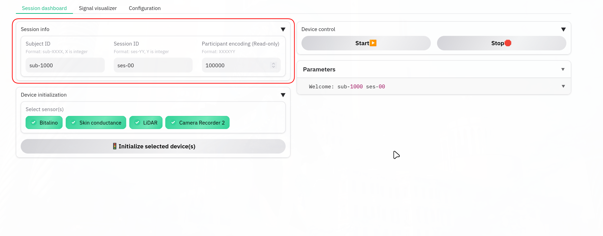
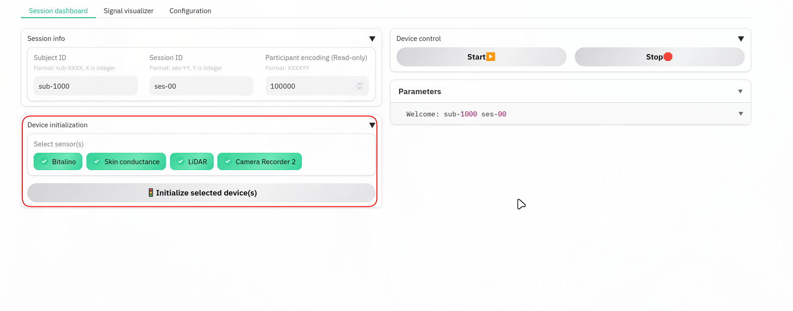
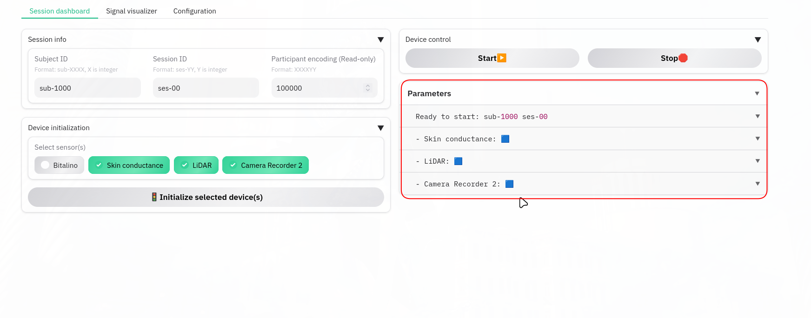
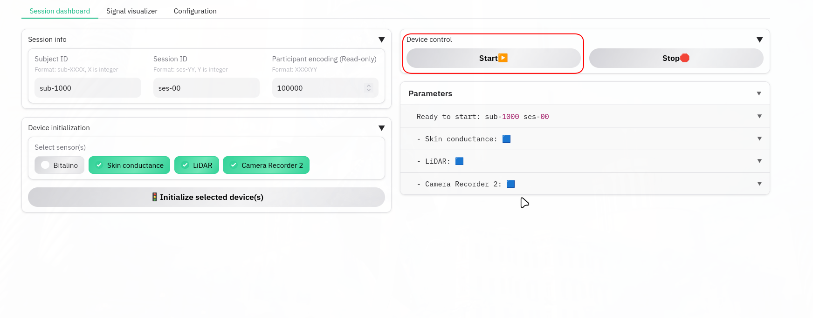
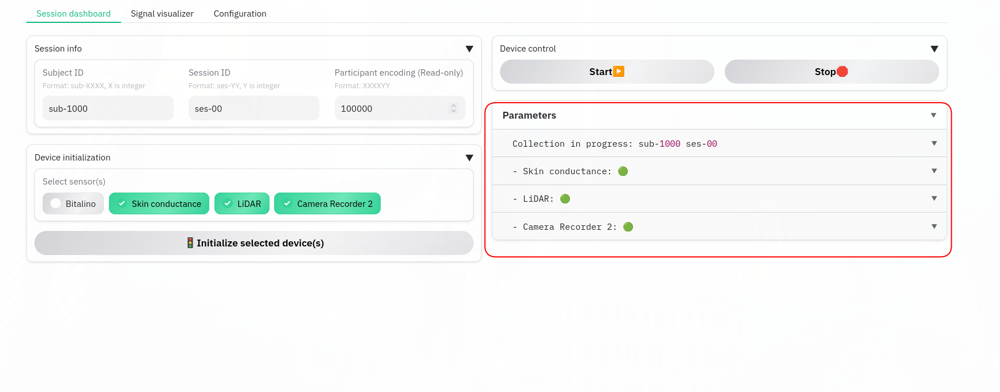
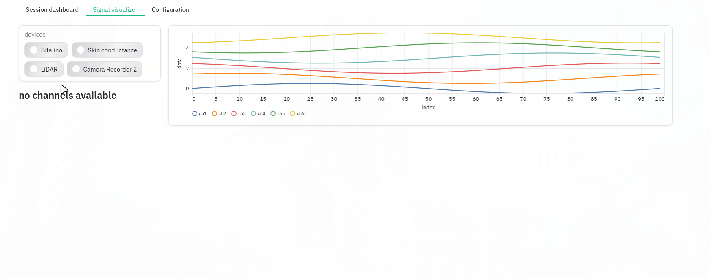
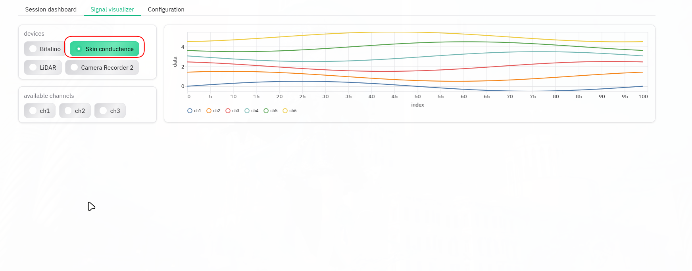
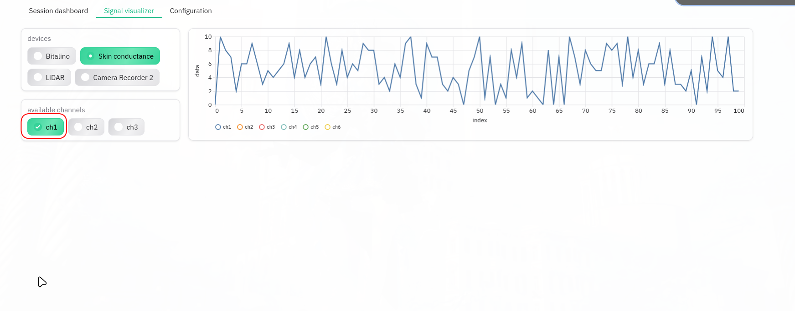
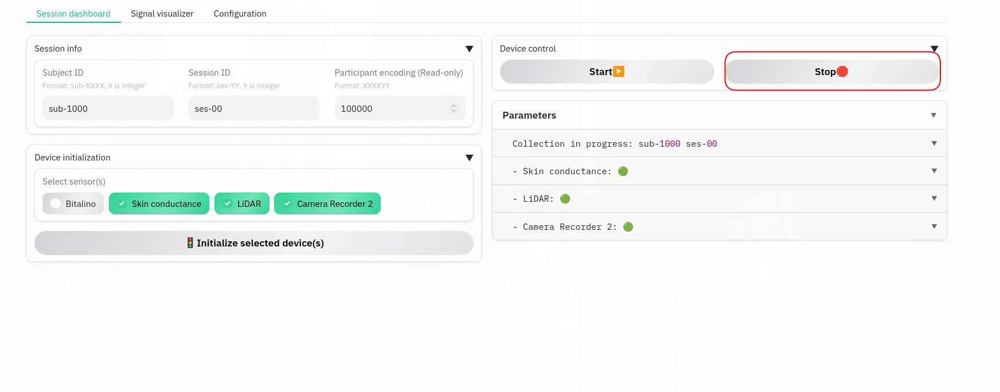

# PLASMA

PLASMA: Platform for LSL-based Acquisition of Sensor Metrics and Analytics

## Features

- 🔌 Modular device architecture (plug-and-play sensor integration)
- 📡 Native **LSL / liblsl** support for real-time streaming
- 🧩 Easy extension via device templates
- 📊 Integrated data memo and visualization hooks
- 💾 Compatible with **LabRecorder** for synchronized data capture

---

## Quickstart

### Run app

1. (Optional) create a dedicated conda environment
    - `conda create -n plasma python=3.12`
    - `conda activate plasma`
2. Clone this repository
    - `git clone https://github.com/YuyiChang/PLASMA.git`
    - `cd PLASMA`
3. Install dependencies
    - `pip install -r requirements.txt`
4. Config `liblsl`
    - With conda environment
        - `conda install -c conda-forge liblsl`
    - Without conda environment
        - Install the appropriate liblsl build for your OS by following:
        - `https://labstreaminglayer.readthedocs.io/dev/build_env.html`
5. Launch PLASMA
    - `python -m plasma`
    - Visit http://127.0.0.1:7860 (by default, check on-screen prompt)

### Use the app 
1. Enter your session info


2. Initalize the device(s) you need


    Blue square will appear if the device(s) are successfully initalized


3. Start data collection


    green circle will appear if the device(s) begins collecting data


4. Visualization


5. Select device to visualize


6. Select channel(s) to visualize


7. Stop data collection 


### Use your custom device
1. create a new file under `plasma/devices/` folder
    - In this example we will call it `custom.py`

2. import the device template and neccssary libraries
    ```python
    from plasma.devices.template import PlasmaDevice, PlasmaMemo
    from pylsl import StreamInfo, StreamOutlet
    import random #for demo only, change to your own device's library
    ```
3. create custom device class
    ```python
    class CustomDevice(PlasmaDevice):
        def __init__(self, session_info, logger=None, tag=None):

            # PlasmaDevice __init__ arguments:
            #    - session_info : session metadata (configured via GUI)
            #    - logger       : session logger (handled internally)
            #    - tag          : device name (configured in config.py)
            #    - num_channel  : number of channel (enter the amount of channel, default to 1)
            super().__init__(session_info, logger, tag, num_channel=1)
            
            # define your outlet to liblsl here
            # for more info about liblsl and pylsl check:
            # https://github.com/labstreaminglayer/pylsl
            # https://labstreaminglayer.readthedocs.io/projects/liblsl/
            info = StreamInfo('CustomDevice', 'custom', 11, 1000, 'int64')
            self.outlet = StreamOutlet(info)

            print("======= start dev")
            
            #initalize device
            try:
                self.device = random.Random(42) # replace with code to connect to your device here  
                print("============ Device init complete")
            except Exception as e:
                self.memo.sts = f"❌ Fault {str(e)}"
                print("============", str(e))
        
        def streaming(self):
            # your custom sensor callback goes here
            while not self._stop_event.is_set():
                data = self.device.randint(1, 10) # replace with the code that returns readings from your device 

                # debug message to memo
                self.last_data = (f"{self.tag} reading at {time.time()}")
                self.memo.set_latest(f"{self.tag} reading at {time.time()}")

                # push your data to memo for display
                # self.memo.set_data takes in ch1, ch2, ..., ch6
                # each parameter can be:
                #    - int
                #    - list
                #    - numpy array
                self.memo.set_data(ch1 = data)

                # save data to LabRecorder
                # use push_chunk if you are pushing a batch of data
                self.outlet.push_sample(data)
                time.sleep(1)
    ```
4. add your device in config
    - locate `config.py` under `plasma` folder
    - add for device in device table
    ```python
    'CustomDevice': {
        'module': 'plasma.devices.custom',
        'class': 'CustomDevice',
    }
    ```

## Known issue

- [ ] need manually set lidar ip addr

## references

- qb2: https://docs.blickfeld.com/qb2/Qb2/v1.10/guides/api.html
- pupil-labs: https://pupil-labs.github.io/pl-realtime-api/dev/